# WORCSPACE

A modern, feature-rich web application built with React and Vite. This project provides a comprehensive platform for managing agents, executions, integrations, jobs, and more through an intuitive user interface.

## 🖼️ Gallery

### Core Modules Screenshots

#### Agents Management
- **Agents  View** - 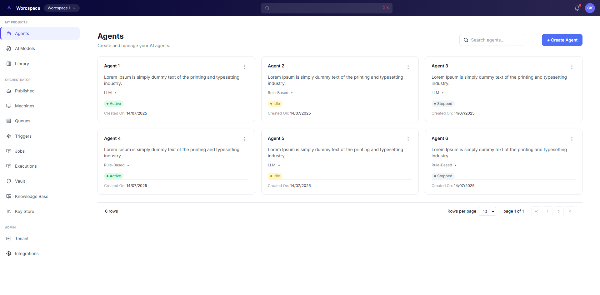

#### Executions
- **Executions  View** - 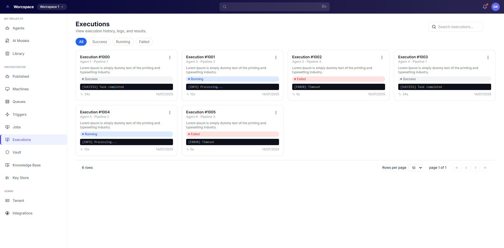


#### Integrations
- **Integrations Grid View** - 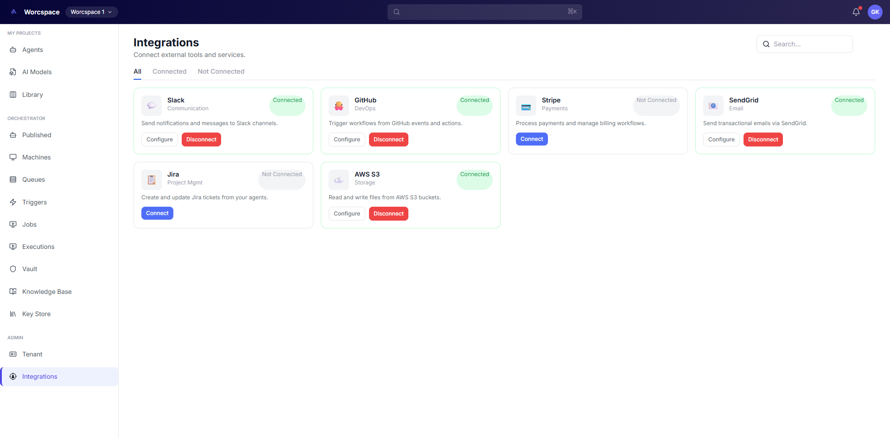


#### Jobs Management
- **Jobs Grid View** - 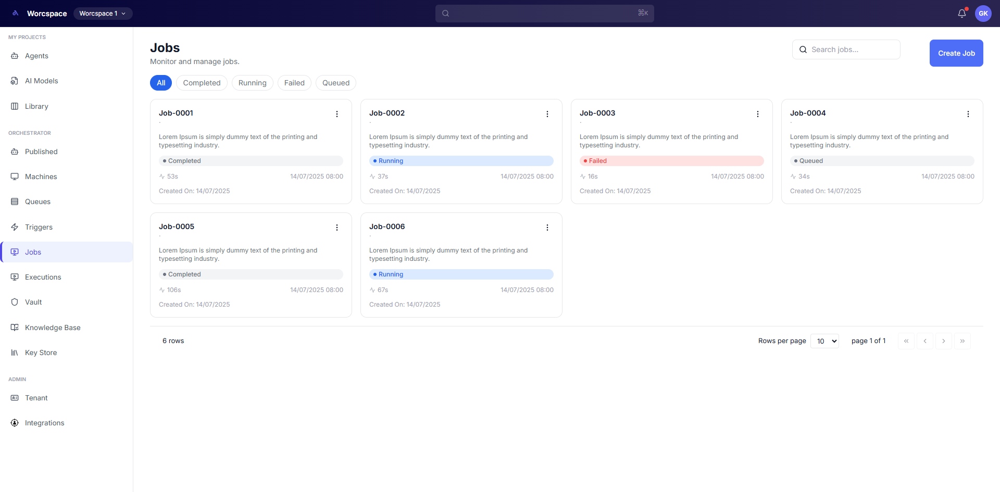


#### Key Store
- **Key Store Grid View** - 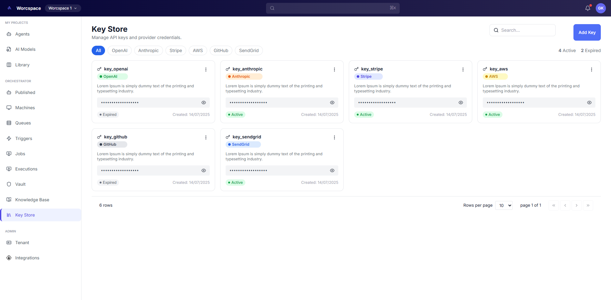


#### Knowledge Base
- **Knowledge Base Grid View** - 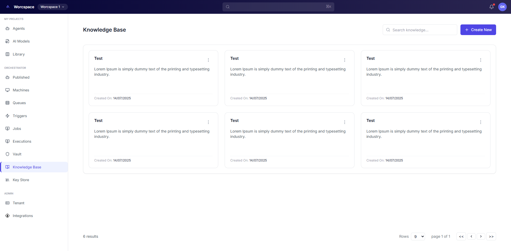


#### Library
- **Library Grid View** - 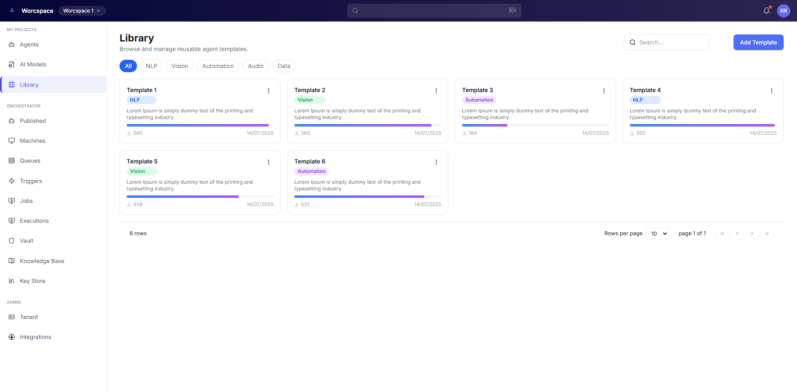


#### Machines
- **Machines Grid View** - 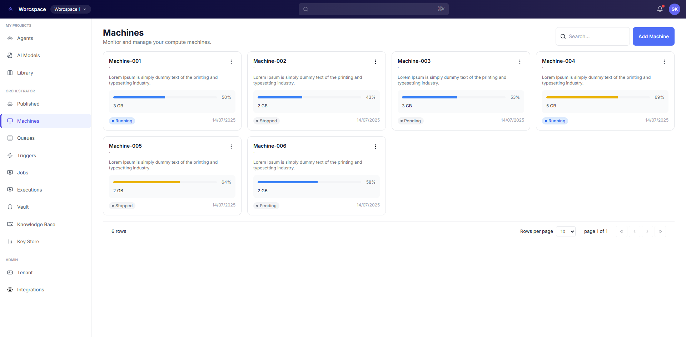

#### Models
- **Models Grid View** - 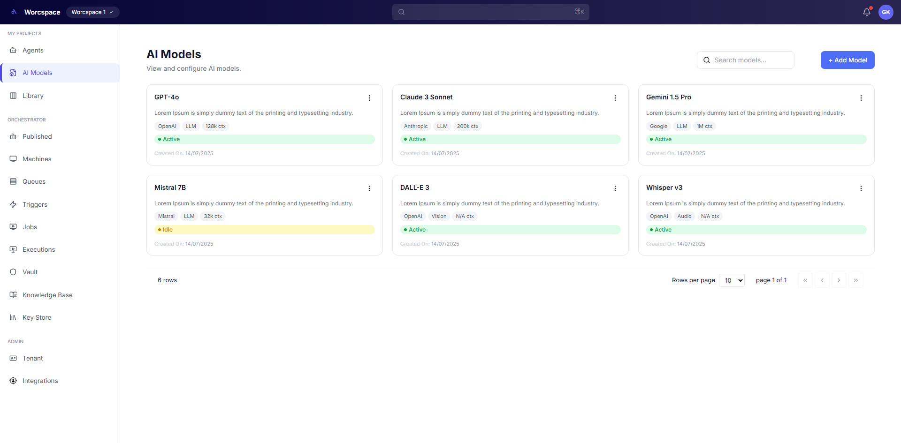


#### Published Pipelines
- **Published Grid View** - 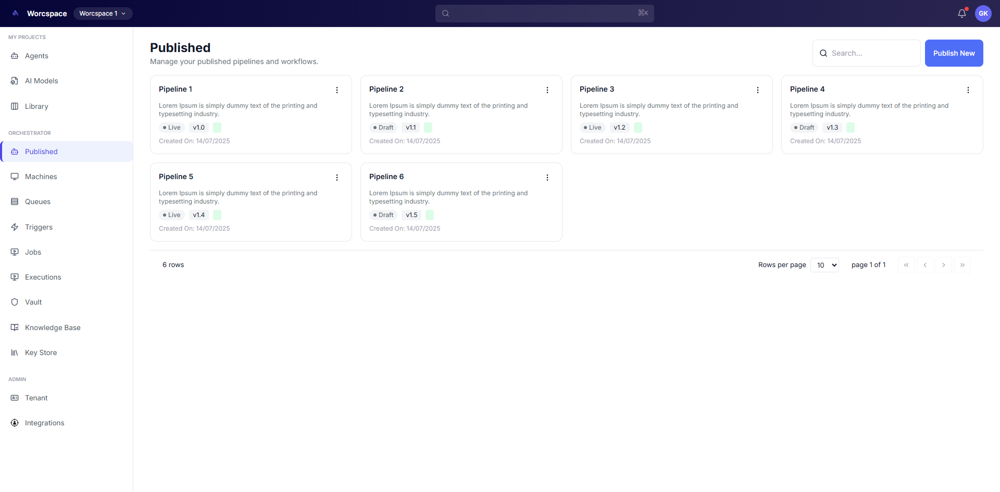


#### Queues
- **Queues Grid View** - 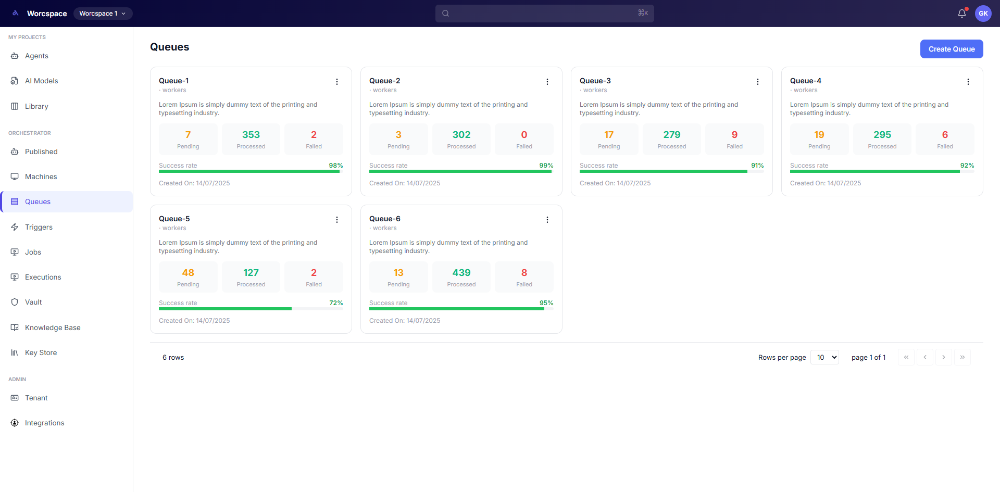


#### Triggers
- **Triggers Grid View** - 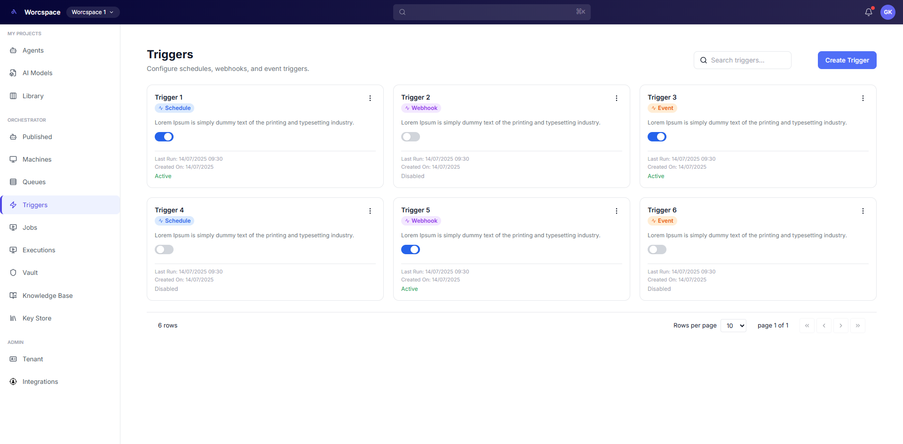


#### Vault
- **Vault Grid View** - 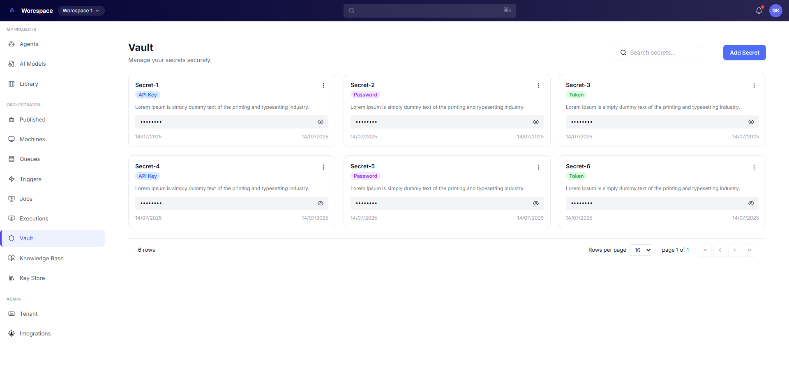


#### Tenant Settings
- **Tenant Settings Page** - 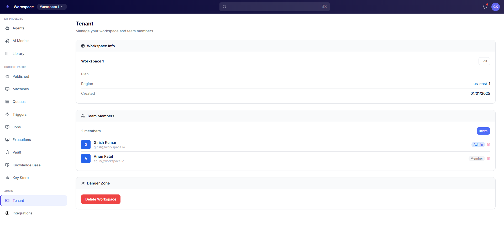


### UI Components Screenshots


### Modal Dialogs

- **Create Modal Base** - .webp)
- **Edit Modal** - .webp)
- **View Modal** - .webp)
- **Delete Confirmation Modal** - .webp)

> **Note**: To use this gallery, create a `public/screenshots/` directory in the root of your repository and add the corresponding images.

## 🌟 Features

### Core Modules
- **Agents Management** - Create and manage AI agents
- **Executions Tracking** - Monitor and filter execution history
- **Integrations** - Configure and manage third-party integrations
- **Jobs Management** - Schedule and manage background jobs
- **Key Store** - Secure credential and API key management
- **Knowledge Base** - Manage and organize knowledge resources
- **Library** - Access and categorize reusable components
- **Machines** - Monitor and manage machine resources
- **Models** - Browse and manage AI models
- **Published Pipelines** - View and manage published workflows
- **Queues** - Manage message and task queues
- **Triggers** - Configure event-based triggers
- **Vault** - Secure data vault for sensitive information
- **Tenant Management** - Handle workspace settings and member management

### UI Components
- Responsive layout with header and sidebar navigation
- Modal dialogs for create, edit, view, and delete operations
- Reusable card-based grid layouts
- Form components with validation
- Icon system for consistent visual language
- Empty state components for better UX
- Filter and search capabilities across modules

## 🛠️ Tech Stack

- **Frontend Framework**: React 18+
- **Build Tool**: Vite
- **Styling**: Tailwind CSS
- **CSS Processing**: PostCSS
- **Code Quality**: ESLint
- **Package Manager**: npm

## 📋 Project Structure

```
worcspace/
│
├── node_modules/
├── public/
│
├── src/
│   │
│   ├── assets/
│   │
│   ├── components/
│   │   │
│   │   ├── common/
│   │   │   │
│   │   │   ├── card/
│   │   │   │   └── Card.jsx
│   │   │   │
│   │   │   ├── form/
│   │   │   │   └── FormField.jsx
│   │   │   │
│   │   │   ├── icons/
│   │   │   │   └── Icons.jsx
│   │   │   │
│   │   │   ├── layout/
│   │   │   │   ├── Header.jsx
│   │   │   │   ├── Sidebar.jsx
│   │   │   │   ├── CardGridPage.jsx
│   │   │   │   └── EmptyState.jsx
│   │   │   │
│   │   │   ├── modal/
│   │   │   │   ├── CreateBaseModal.jsx
│   │   │   │   ├── DeleteConfirmModal.jsx
│   │   │   │   ├── EditModal.jsx
│   │   │   │   ├── Modal.jsx
│   │   │   │   └── ViewModal.jsx
│   │   │   │
│   │   │   └── ui/
│   │   │       ├── Button.jsx
│   │   │       ├── TextInput.jsx
│   │   │       ├── TextArea.jsx
│   │   │       └── SelectInput.jsx
│   │   │
│   │   └── features/
│   │       │
│   │       ├── Agents/
│   │       │   ├── AgentCard.jsx
│   │       │   └── AgentsGrid.jsx
│   │       │
│   │       ├── Executions/
│   │       │   ├── ExecutionCard.jsx
│   │       │   ├── ExecutionFilters.jsx
│   │       │   ├── ExecutionGrid.jsx
│   │       │   ├── ExecutionHeader.jsx
│   │       │   └── ExecutionViewModal.jsx
│   │       │
│   │       ├── Integrations/
│   │       │   ├── ConfigModal.jsx
│   │       │   ├── IntegrationCard.jsx
│   │       │   ├── IntegrationFilters.jsx
│   │       │   ├── IntegrationGrid.jsx
│   │       │   └── IntegrationHeader.jsx
│   │       │
│   │       ├── Jobs/
│   │       │   ├── JobCard.jsx
│   │       │   ├── JobEditModal.jsx
│   │       │   ├── JobsFilters.jsx
│   │       │   ├── JobsGrid.jsx
│   │       │   └── JobsHeader.jsx
│   │       │
│   │       ├── KeyStore/
│   │       │   ├── KeyCard.jsx
│   │       │   ├── KeyStoreFilters.jsx
│   │       │   ├── KeyStoreGrid.jsx
│   │       │   ├── KeyStoreHeader.jsx
│   │       │   └── ProviderBadge.jsx
│   │       │
│   │       ├── KnowledgeBase/
│   │       │   ├── KnowledgeBaseCard.jsx
│   │       │   ├── EmptyState.jsx
│   │       │
│   │       ├── Library/
│   │       │   ├── CategoryBadge.jsx
│   │       │   ├── LibraryCard.jsx
│   │       │   ├── LibraryFilters.jsx
│   │       │   ├── LibraryGrid.jsx
│   │       │   └── LibraryHeader.jsx
│   │       │
│   │       ├── Machines/
│   │       │   ├── MachineCard.jsx
│   │       │   ├── MachinesGrid.jsx
│   │       │   └── MachinesHeader.jsx
│   │       │
│   │       ├── Models/
│   │       │   ├── ModelCard.jsx
│   │       │   └── ModelCardRenderer.jsx
│   │       │
│   │       ├── Published/
│   │       │   ├── PipelineCard.jsx
│   │       │   ├── PublishedGrid.jsx
│   │       │   └── PublishedHeader.jsx
│   │       │
│   │       ├── Queues/
│   │       │   ├── QueueCard.jsx
│   │       │   ├── QueueGrid.jsx
│   │       │   └── QueueHeader.jsx
│   │       │
│   │       ├── Tenant/
│   │       │   ├── DangerSection.jsx
│   │       │   ├── InfoRow.jsx
│   │       │   ├── InviteModal.jsx
│   │       │   ├── MemberRow.jsx
│   │       │   ├── MemberSection.jsx
│   │       │   ├── PlanBadge.jsx
│   │       │   ├── SectionCard.jsx
│   │       │   ├── TenantHeader.jsx
│   │       │   └── WorkspaceSection.jsx
│   │       │
│   │       ├── Triggers/
│   │       │   ├── Toggle.jsx
│   │       │   ├── TriggerCard.jsx
│   │       │   ├── TriggerFilters.jsx
│   │       │   ├── TriggerGrid.jsx
│   │       │   ├── TriggersHeader.jsx
│   │       │   └── TypeBadge.jsx
│   │       │
│   │       └── Vault/
│   │           ├── TypeBadge.jsx
│   │           └── VaultCard.jsx
│   │
│   ├── data/
│   │   └── sidebarData.js
│   │
│   ├── pages/
│   │   ├── AgentsPage.jsx
│   │   ├── ExecutionsPage.jsx
│   │   ├── IntegrationsPage.jsx
│   │   ├── JobsPage.jsx
│   │   ├── KeyStorePage.jsx
│   │   ├── KnowledgeBasePage.jsx
│   │   ├── LibraryPage.jsx
│   │   ├── MachinesPage.jsx
│   │   ├── ModelsPage.jsx
│   │   ├── PublishedPage.jsx
│   │   ├── QueuesPage.jsx
│   │   ├── TenantPage.jsx
│   │   ├── TriggersPage.jsx
│   │   └── VaultPage.jsx
│   │
│   ├── router/
│   │   └── AppRouter.jsx
│   │
│   ├── App.jsx
│   ├── main.jsx
│   ├── index.css
│   └── App.css
│
├── .gitignore
├── eslint.config.js
├── index.html
├── package.json
├── package-lock.json
├── postcss.config.js
├── tailwind.config.js
├── vite.config.js
└── README.md
```

## 🚀 Getting Started

### Prerequisites

- Node.js (v16 or higher)
- npm (v7 or higher)

### Installation

1. Clone the repository:
```bash
git clone https://github.com/sankha1545/Avintisia.git
cd webapp
```

2. Install dependencies:
```bash
npm install
```

3. Start the development server:
```bash
npm run dev
```

The application will be available at `http://localhost:5173`

## 📦 Available Scripts

### Development
```bash
npm run dev        # Start Vite development server
```

### Production
```bash
npm run build      # Build for production
npm run preview    # Preview production build locally
```

### Code Quality
```bash
npm run lint       # Run ESLint
npm run lint:fix   # Fix ESLint issues
```

## 🎨 Component Architecture

### Common Components

#### Layout Components
- **Header** - Application header with branding
- **Sidebar** - Main navigation sidebar
- **CardGridPage** - Reusable grid layout for card displays
- **EmptyState** - Display when no data is available

#### UI Components
- **Button** - Standard button component
- **TextInput** - Text input field
- **TextArea** - Multi-line text input
- **SelectInput** - Dropdown select component
- **Card** - Card container for content

#### Modal Components
- **Modal** - Base modal component
- **CreateBaseModal** - Create new resources
- **EditModal** - Edit existing resources
- **ViewModal** - View resource details
- **DeleteConfirmModal** - Confirm deletion

### Feature Components

Each feature module follows a consistent pattern:
- **Grid Component** - Display list of items in grid layout
- **Card Component** - Individual item display
- **Header Component** - Feature header with actions
- **Filter Component** - Search and filter capabilities
- **Modal Component** - Create/Edit/View specific to the feature

## 🔄 Routing

Routes are managed through `AppRouter.jsx` and pages are located in the `pages/` directory. Each feature has a corresponding page component that serves as the main entry point.

### Available Routes
- `/agents` - Agents Management
- `/executions` - Executions Tracking
- `/integrations` - Integrations
- `/jobs` - Jobs Management
- `/keystore` - Key Store
- `/knowledgebase` - Knowledge Base
- `/library` - Library
- `/machines` - Machines
- `/models` - Models
- `/published` - Published Pipelines
- `/queues` - Queues
- `/triggers` - Triggers
- `/vault` - Vault
- `/tenant` - Tenant Settings

## 🎯 Development Guidelines

### Component Naming
- Use PascalCase for component files and exports
- Use descriptive names that indicate the component's purpose
- Group related components in feature directories

### Styling
- Use Tailwind CSS utility classes for styling
- Maintain consistent spacing and sizing
- Use CSS modules when needed for scoped styles
- Follow the design system defined in `tailwind.config.js`

### File Organization
- Keep components focused and single-responsibility
- Place shared utilities and helpers in the `common/` directory
- Feature-specific components stay in their feature folder
- Use index files for clean imports

### Code Quality
- Run `npm run lint` before committing
- Follow ESLint configuration rules
- Write semantic HTML
- Ensure accessibility best practices

## 🔐 Environment Variables (for future scope)

Create a `.env` file in the root directory:

```env
VITE_API_URL=your_api_endpoint
VITE_APP_NAME=WebApp
```

Reference these in your code using `import.meta.env.VITE_*`

## 📚 Dependencies

### Main Dependencies
- **react** - UI library
- **react-dom** - React DOM bindings
- **react-router-dom** - Client-side routing

### Dev Dependencies
- **vite** - Build tool and dev server
- **tailwindcss** - Utility-first CSS framework
- **postcss** - CSS processing
- **eslint** - Code quality tool

Run `npm list` to see all installed dependencies.

## 🤝 Contributing

1. Create a feature branch (`git checkout -b feature/AmazingFeature`)
2. Commit your changes (`git commit -m 'Add some AmazingFeature'`)
3. Push to the branch (`git push origin feature/AmazingFeature`)
4. Open a Pull Request

Please ensure:
- Code follows the existing style
- Components are properly documented
- ESLint passes without errors
- All changes are tested

## 📝 License

This project is licensed under the MIT License - see the LICENSE file for details.

## 🆘 Support

For support, email sankhasubhradas1@gmail.com or open an issue in the repository.

## 📞 Contact

- **Project Lead**: Sankha Subhra Das
- **Email**: sankhasubhradas1@gmail.com
- **GitHub**: [@sankha1545](https://github.com/sankha1545)
- **Live Demo**: [Avintisia](https://avintisia.vercel.app/)

## 🙏 Acknowledgments

- Thanks to all contributors
- Inspired by modern web application standards
- Built with ❤️ using React and Vite

---

**Last Updated**: March 2024
**Version**: 1.0.0

**Last Updated**: March 2024
**Version**: 1.0.0


